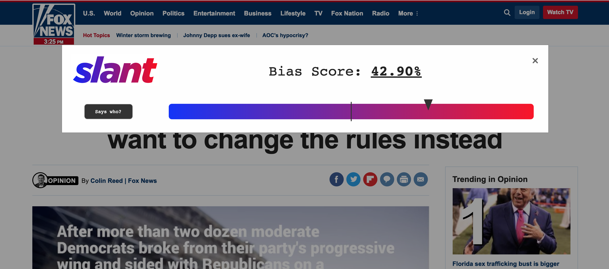
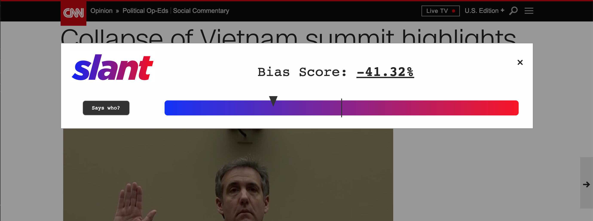

<br><br>
<p align="center">
	
</p>
<br><br>

## What are we trying to solve?

The term Fake News has been a wildly-discussed talking point, potentially due to the 2016 election. While Slant feels many are aware that deceitful news exists, many seem to struggle with determining when their sources are biased. In fact, a December 2016 survey by the Pew Research Center suggests that 23 percent of U.S. adults have shared fake news, knowingly or unknowingly, with friends and others.

Why is this happening? According to a study by The Knight Foundation, machine learning models have estimated that 33% of the 100 most-followed accounts in their postelection map are “bots”, or automated accounts. This means fake, deceitful and biased news can be shared by automated accounts in order to increase the likelihood that the stories reach your timeline. 

What can we do? Understanding our bias can allow for us to look more objectively at the world around us. When reading an article shared online, we need to ask ourselves: “Who wrote this?”, “What is the intent of this article?”, “Does this story make sense, or does it just align with my own political opinions?”, etc. By having Slant remind users of the biases on the websites they are visiting, the everyday person who wishes to develop their own political views can remain aware of the biases around them. 


## Slant Frontend

We made our frontend with the Chrome Extensions API.

 <br><br>
<p align="center">
  
  <br>
  
</p>
<br><br>

## Slant Backend

### Installing Dependencies

We've enumerated our Python dependencies in `requirements.txt`. To install them all, type `pip install -r requirements.txt`.

### Downloading Stuff

We used checkpoints for our Skip-Thoughts model that were pretrained on the [BookCorpus](http://yknzhu.wixsite.com/mbweb) dataset to understand English. You can download those by running `cd model; ./download_pretrained_models.sh`. Be warned: they are quite large (10 Gb or so).

Our sentiment analysis also requires a pre-trained English tokenizer. To download this, run `python` and type:
```
import nltk
nltk.download('punkt')
```

### Our Corpus
We classified political bias using the [Ideological Books Corpus](https://people.cs.umass.edu/~miyyer/ibc/). This dataset contains labeled data related to American politics. A political science expert labeled sentences from books and magazines written by authors with known ideologies. Specifically, it has 2025 liberal sentences, 1701 conservative sentences, and 600 neutral sentences. Each sentence was labeled by a political science expert.

### Running the App
To run dev Flask Server: `python -m flask run`

If you have the debugger disabled or trust the users on your network, you can make the server publicly available simply by adding --host=0.0.0.0 to the command line:

flask run --host=0.0.0.0

### Caching

Our model is expensive, so we cache its results. We implement our caching using [Redis], a fast in-memory data store. We followed [this tutorial](https://www.digitalocean.com/community/tutorials/how-to-install-and-secure-redis-on-ubuntu-18-04) to initialize Redis on our cloud VM running Ubuntu 18.04. We use the [python-redis](https://redislabs.com/lp/python-redis/) package to communicate with Redis.

### Production

We configured the app for production by following this wonderful tutorial: [How To Serve Flask Applications with uWSGI and Nginx on Ubuntu 18.04](https://www.digitalocean.com/community/tutorials/how-to-serve-flask-applications-with-uswgi-and-nginx-on-ubuntu-18-04).

Now, every time we update the backend, we can just run a `git pull` and then restart the running application via `sudo systemctl restart slantapp`.

### Inspiration

We're thankful for a whole host of work that existed on this topic before we began the Slant project. Truly, we stand on the shoulders of giants. Specifically, we've based our work off of these two papers:

- Measuring Ideological Proportions in Political Speeches (https://www.cs.cmu.edu/~nasmith/papers/sim+acree+gross+smith.emnlp13.pdf)
- Skip-Thought Vectors (https://papers.nips.cc/paper/5950-skip-thought-vectors.pdf)

and these two Github repositories:

- this demo from Tensorflow https://github.com/tensorflow/models/tree/master/research/skip_thoughts
- this guy's project that used the skip-vector model for classification https://github.com/jz359/modemo
